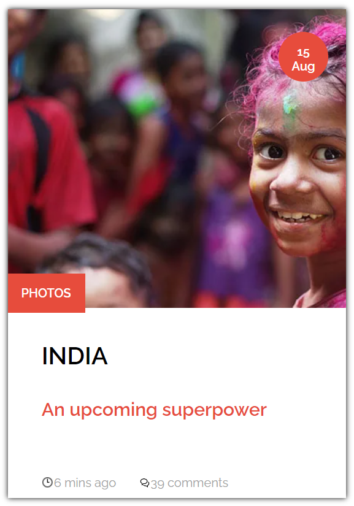
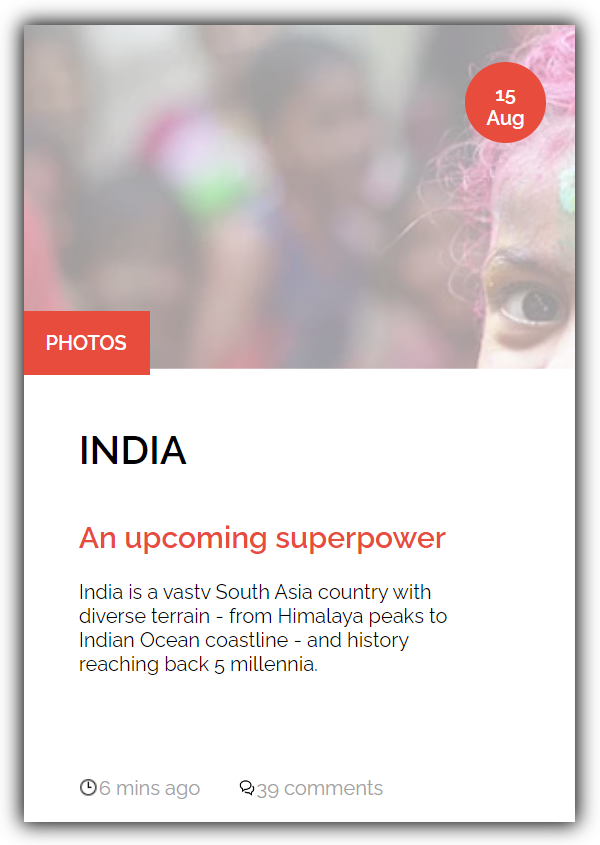

# learning-sass

In this repository, I experimented with the SASS language.
This project consists in the realization of a map which is animated when you fly over it.

 

---

Project completed

This repository was created and edited on November 21, 2022. This project is an exercise realized during the training web developer junior given by Becode.org.

---

## Language

- HTML
- CSS
- SASS

---

## How to install the repository locally

1. create a local working folder
2. open Git Bash
3. clone the repository
4. now you can work on the file

---

[Link to my Github page.](https://mathildecornelis.github.io/learning-sass/)
